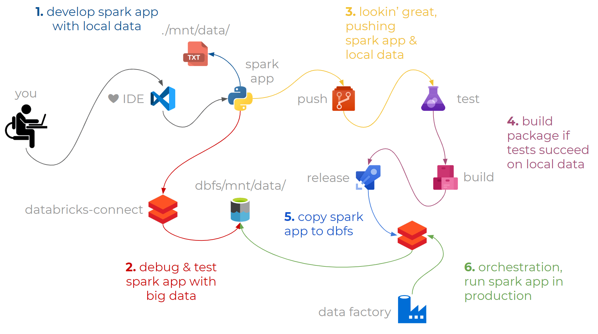
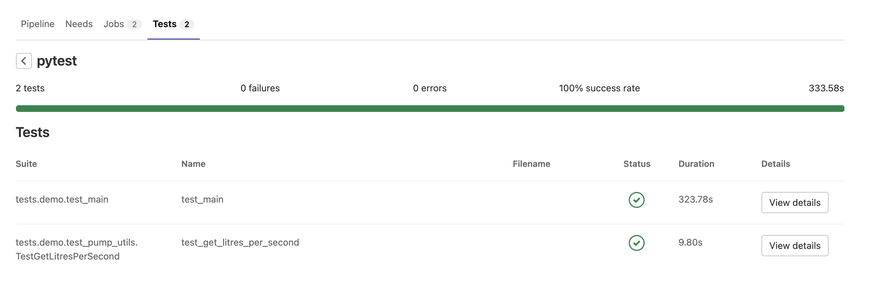

# Table of contents

|Title|Description|
|-|-|
|[Databricks APIs](#databricks-apis)|How to use the Databricks APIs|
|[Runners and agents](#runners-and-agents)|Configuring runners for GitLab, GitHub, Azure DevOps.|
|[Development environments](#development-environments)|Configuring your development environment for unit testing, and improved development experience.|
|[Testing and validation](#testing-and-validation)|Test and validate your ETL/application code.|


# Databricks APIs 
This library supports deployment of Databricks resources within a specified Databricks workspace. 


## Requirements 
- python 3.6 and above. 
- libraries: 

```
pip install click==8.0.1
pip install databricks-cli==0.17.3
```

## Reference
|Name and URL|Relevenace|
|-|-|
|[Databricks CLI](https://github.com/databricks/databricks-cli)|Databricks CLI (API modules) is imported into python scripts.| 
|[Databricks API](https://docs.databricks.com/dev-tools/api/latest)|Databricks API official docs for reference.|


# Usage 

## Authentication 
Export or set the following environment variables: 

Mac 
```
export DATABRICKS_TOKEN=<your databricks personal access token>
```

Windows
```
set DATABRICKS_TOKEN=<your databricks personal access token>
```

The token will be used to authorize to the selected workspace. To generate your personal access token, see: [https://docs.databricks.com/dev-tools/api/latest/authentication.html](https://docs.databricks.com/dev-tools/api/latest/authentication.html)

## Deploying config

To deploy the required configuration, add all the required scripts into the [deploy_master.sh](deploy_master.sh) Bash script.

## Configuration 
To deploy resources into your workspace, you will need to create a `config.<env_code>.json` file. 

At minimum, the `config.<env_code>.json` file will need to contain: 
```json
{
    "azure": {
        "tenant_Id": "<Customer Tenant ID>",
        "subscription_id": "<Customer Subscription ID>",
        "service_principal_appId": "<Azure AD service principal client ID>",
        "keyvault_name": "<Key Vault URL>"
    }
}
```

Example: 
```json
{
    "azure": {
        "tenant_Id": "67a30ef2-0e3c-4839-bb1d-f572e5bb35de",
        "subscription_id": "42127ebb-7b1c-4da1-8e7a-3b735c00a95c",
        "service_principal_appId": "5ee3ec66-5127-48ec-8d50-7c0d3b67bac3",
        "keyvault_name": "wtdemo-akv"
    }
}
```

Within the `config.json` file, you may wish to add additional resources to be deployed. For each resource type, see below. 

# APIs

<details>
<summary><strong>Cluster APIs</strong></summary>

To deploy clusters into your Databricks workspace, add the additional key-value pair: 
```json
"clusters": [
        {
            "<cluster_specific_keys>": "<cluster_specific_values>"
        }
    ]
```

For example: 
```json
"clusters": [
        {
            "cluster_name": "my-cluster-001",
            "spark_version": "7.3.x-scala2.12",
            "node_type_id": "i3.xlarge",
            "spark_conf": {
              "spark.speculation": true
            },
            "aws_attributes": {
              "availability": "SPOT",
              "zone_id": "ap-southeast-2b"
            },
            "num_workers": 2
        }
    ]
```

For a full listing of available properties, see: https://docs.databricks.com/sql/api/sql-endpoints.html

</details>


<details>
<summary><strong>SQL Endpoints APIs</strong></summary>

To deploy SQL Endpoints into your Databricks workspace, add the additional key-value pair: 
```json
"sql_endpoints": [
        {
            "<sql_endpoints_specific_keys>": "<sql_endpoints_specific_values>"
        }
    ]
```

For example: 
```json
"sql_endpoints":[
    {
        "name": "sql_endpoint_1",
        "cluster_size": "2X-Small",
        "min_num_clusters": 1,
        "max_num_clusters": 4,
        "tags": {
            "custom_tags": [
                {
                    "key": "mykey",
                    "value": "myvalue"
                }
            ]
        },
        "spot_instance_policy":"COST_OPTIMIZED",
        "enable_photon": "false",
        "enable_serverless_compute": "false"
    }
]
```

For a full listing of available properties, see: [https://docs.databricks.com/dev-tools/api/latest/clusters.html#clusterautoscale](https://docs.databricks.com/dev-tools/api/latest/clusters.html#clusterautoscale)

</details>


<details>
<summary><strong>Users APIs</strong></summary>

Databricks users can be created in two ways: 
1. Users only in Databricks 
2. Users synced with your Identity Provider (e.g. Azure AD, Okta)

<strong>Users only in Databricks</strong>

To deploy users into your Databricks workspace, add the additional key-value pair: 
```json
"users": [
        {
            "<user_specific_keys>": "<user_specific_values>"
        }
    ]
```

For example: 
```json
"users": [
        {
        "schemas": [ "urn:ietf:params:scim:schemas:core:2.0:User" ],
        "userName": "hello-world@cuusoo.com.au",
        "groups": [
          {
             "value":"users"
          }
        ],
        "entitlements":[
          {
            "value":"allow-cluster-create"
         },
         {
           "value": "databricks-sql-access"
         }
        ]
      }
    ]
```

For a full listing of available properties, see: [https://docs.databricks.com/dev-tools/api/latest/scim/scim-users.html](https://docs.databricks.com/dev-tools/api/latest/scim/scim-users.html)

<strong>Users synced with your Identity provider</strong>

> Coming soon... For now, refer to: https://docs.databricks.com/administration-guide/users-groups/scim/index.html

</details>


<details>
<summary><strong>Groups APIs</strong></summary>

To create groups and add existing users or existing groups to parent groups, add the additional key-value pair: 
```json
"groups": [
    {
        "group_name": "name of group",
        "members":[
            {
                "type": "type of member:  either `user` or `group`",
                "name": "name of the member"
            }
        ]
    }
]
```

For example: 
```json
"groups":[
    {
        "group_name": "groupA",
        "members":[
            {
                "type": "user",
                "name": "hello.world@cuusoo.com.au"
            },
            {
                "type": "group",
                "name": "users"
            }
        ]
    }
]
```

Note: if you wish to create a new group (e.g. GroupB) and add the newly created group to an existing group (e.g. GroupA), then you would configure the json with dependency as follows: 
```json
"groups":[
    {
      "group_name": "groupB" // create group B first  
    },
    {
        "group_name": "groupA",
        "members":[
            {
                "type": "group",
                "name": "groupB" // add group B to group A 
            }
        ]
    }
]
```

</details>


<details>
<summary><strong>Directories APIs</strong></summary>

To upload directories (with databricks files) to a databricks workspace, add the additional key-value pair: 
```json
"directories":[
    {
        "source_path": "<source_path>", // do not include "/" at the start 
        "target_path": "<target_path>",  // should include "/" at the start 
        "overwrite": <true or false>, // replaces existing files if true. boolean: true or false 
        "exclude_hidden_files": <true or false> // excludes hidden files if true, for example files that begin with ".". boolean: true or false 
    }
]
```

For example: 
```json
"directories":[
    {
        "source_path": "test_folder1",
        "target_path": "test_folder1", 
        "overwrite": true,
        "exclude_hidden_files": true
    },
    {
        "source_path": "test_folder2/scala",
        "target_path": "test_folder2/scala", 
        "overwrite": true,
        "exclude_hidden_files": true
    }
]
```

Note: Only files with the following valid extensions can be uploaded: `.scala, .py, .sql, .SQL, .r, .R, .ipynb, .html, .dbc`. 

</details>


<details>
<summary><strong>DBFS APIs</strong></summary>

To upload content to the Databricks FileSystem (DBFS), add the additional key-value pair: 
```json
"directories":[
    {
        "source_path": "<source_path>", // do not include "/" at the start 
        "target_path": "<dbfs:/target_path>",  // should include "/" at the start 
        "overwrite": <true or false>, // replaces existing files if true. boolean: true or false 
        "recursive": <true or false> // copies all files from source folder 
    }
]
```

For example: 
```json
"directories":[
    {
        "source_path": "sample_folder",
        "target_path": "dbfs:/sample_folder", 
        "overwrite": true,
        "exclude_hidden_files": true
    }
]
```

Note: Only files with the following valid extensions can be uploaded: `.scala, .py, .sql, .SQL, .r, .R, .ipynb, .html, .dbc`. 

</details>


<details>
<summary><strong>Permissions (Cluster) APIs</strong></summary>

To configure permissions to clusters, use the following key-value pairs: 

```json
"permissions_clusters":[
    {
        "cluster_name": "<your_cluster_name>",
        "access_control_list":[
            {
                "user_name": "<your_user_name>",
                "permission_level": "Choose one of: [CAN_MANAGE, CAN_RESTART, CAN_ATTACH_TO]"
            },
            {
                "group_name": "<your_group_name>",
                "permission_level": "Choose one of: [CAN_MANAGE, CAN_RESTART, CAN_ATTACH_TO]"
            }
        ]
    }
]
```

Example: 

```json
"permissions_clusters":[
    {
    "cluster_name": "my-cluster-001",
    "access_control_list":[
            {
                "user_name": "hello-world@cuusoo.com.au",
                "permission_level": "CAN_MANAGE"
            },
            {
                "group_name": "groupA",
                "permission_level": "CAN_ATTACH_TO"
            }
        ]
    }
]
```

For more information about permission levels, see: https://docs.databricks.com/dev-tools/api/latest/permissions.html#operation/get-clusters-permission-levels

</details>


<details>
<summary><strong>Permissions (SQL Endpoints) APIs</strong></summary>

To configure permissions to SQL endpoints, use the following key-value pairs: 

```json
"permissions_sql_endpoints":[
    {
        "sql_endpoint_name": "<your_sql_endpoint_name>",
        "access_control_list":[
            {
                "user_name": "<your_user_name>",
                "permission_level": "Choose one of: [CAN_USE, CAN_MANAGE]"
            },
            {
                "group_name": "<your_group_name>",
                "permission_level": "Choose one of: [CAN_USE, CAN_MANAGE]"
            }
        ]
    }
]
```

Example: 

```json
"permissions_sql_endpoints":[
    {
        "sql_endpoint_name": "sql_endpoint_1",
        "access_control_list":[
            {
                "user_name": "hello-world@cuusoo.com.au",
                "permission_level": "CAN_MANAGE"
            },
            {
                "group_name": "groupA",
                "permission_level": "CAN_USE"
            }
        ]
    }
]
```

For more information about permission levels, see: https://docs.databricks.com/dev-tools/api/latest/permissions.html#tag/SQL-endpoint-permissions

</details>


<details>
<summary><strong>Permissions (Directories) APIs</strong></summary>

Note: Permissions on the directory level will result in inheritance in lower-levels of the specified directory. For example, permissions applied at `/test-folder1` will result in the same permissions applied in `/test-folder1/...`

To configure permissions to directories, use the following key-value pairs: 

```json
"permissions_directories":[
    {
        "directory_name": "<your_directory_name>",
        "access_control_list":[
            {
                "user_name": "<your_user_name>",
                "permission_level": "Choose one of: [CAN_READ, CAN_RUN, CAN_EDIT, CAN_MANAGE]"
            },
            {
                "group_name": "<your_group_name>",
                "permission_level": "Choose one of: [CAN_READ, CAN_RUN, CAN_EDIT, CAN_MANAGE]"
            }
        ]
    }
]
```

Example: 

```json
"permissions_directories":[
    {
        "directory_name": "/test_folder1/",
        "access_control_list":[
            {
                "user_name": "hello-world@cuusoo.com.au",
                "permission_level": "CAN_RUN"
            },
            {
                "group_name": "groupA",
                "permission_level": "CAN_READ"
            }
        ]
    }
]
```

For more information about permission levels, see: https://docs.databricks.com/dev-tools/api/latest/permissions.html#tag/Directory-permissions

</details>


<details>
<summary><strong>Permissions (Notebooks) APIs</strong></summary>

To configure permissions to notebooks, use the following key-value pairs: 

```json
"permissions_notebooks":[
    {
        "notebook_name": "<your_notebook_name>",
        "access_control_list":[
            {
                "user_name": "<your_user_name>",
                "permission_level": "Choose one of: [CAN_READ, CAN_RUN, CAN_EDIT, CAN_MANAGE]"
            },
            {
                "group_name": "<your_group_name>",
                "permission_level": "Choose one of: [CAN_READ, CAN_RUN, CAN_EDIT, CAN_MANAGE]"
            }
        ]
    }
]
```

Example: 

```json
"permissions_notebooks":[
    {
        "notebook_name": "/test_folder1/test_notebook1",
        "access_control_list":[
            {
                "user_name": "hello-world@cuusoo.com.au",
                "permission_level": "CAN_RUN"
            },
            {
                "group_name": "groupA",
                "permission_level": "CAN_READ"
            }
        ]
    }
]
```

For more information about permission levels, see: https://docs.databricks.com/dev-tools/api/latest/permissions.html#tag/Notebook-permissions

</details>


# Runners and agents


<details>
<summary><strong>GitLab</strong></summary>

1. Install the GitLab Runner: https://docs.gitlab.com/runner/install/docker.html
2. Register the GitLab Runner: https://docs.gitlab.com/runner/register/index.html#docker
    Tips: 
    ```bash
    # Enter the GitLab instance URL (for example, https://gitlab.com/)
    https://gitlab.mantelgroup.com.au/

    # Enter the registration token
    > go to Settings > CI/CD > Runners > Copy registration token 

    # Enter a description for the runner
    > enter a description of your choice 

    # Enter tags for the runner (comma-separated)
    > leave blank 

    # Enter an executor
    docker

    # Enter the default Docker image (for example, ruby:2.6)
    python:latest
    ```
3. Add a CI/CD variable to a project, see steps here [https://docs.gitlab.com/ee/ci/variables/#add-a-cicd-variable-to-a-project](https://docs.gitlab.com/ee/ci/variables/#add-a-cicd-variable-to-a-project)

</details>


<br>

# Development environments

Setting up your development environment allows you to much more easily productionise your jobs, and also integrate unit testing into your workflow. 

<details>
<summary><strong>Option 1 (recommended): Databricks connect development environment</strong></summary>

Databricks connect allows you to execute Spark code on Databricks clusters, without having to install Spark on your local machine. 



Follow detailed instructions here: https://docs.databricks.com/dev-tools/databricks-connect.html 

tl;dr


<strong>Step 0: install conda and configure python virtual envrionment </strong>

We recommend installaing conda to manage your python virtual environments. See: https://docs.anaconda.com/anaconda/install/index.html

After which, you can create a python virtual environment based on the databricks cluster version you are looking to connect to. See: https://docs.databricks.com/dev-tools/databricks-connect.html#requirements

Example:
```bash
conda create -n pyspark-env python=3.7 # for databricks runtime 7.3 LTS 
```

<strong>Step 1: uninstall pyspark </strong>

You won't need pyspark if you already have it installed. So uninstall it by running: 

```bash 
pip uninstall pyspark
```

<strong>Step 2: install databricks connect </strong>

Install databricks connect by running

```bash 
pip install -U "databricks-connect==7.3.*"  # or X.Y.* to match your cluster version.
```

Note: 
1. The version of databricks connect you install will depend on the cluster version that is databricks connect supported. See: https://docs.databricks.com/dev-tools/databricks-connect.html#requirements
2. Always specify databricks-connect==X.Y.* instead of databricks-connect=X.Y, to make sure that the newest package is installed.

<strong>Step 3: configure databricks connect </strong>

Configure your databricks connect, and follow the prompts. 

```bash 
databricks-connect configure
```

<strong>Step 4: test databricks connect's connectivity </strong>

Test the connectivity by running

```bash 
databricks-connect test
```

You should see the following response (below is shortened): 
```
* Simple Scala test passed
* Testing python command
* Simple PySpark test passed
* Testing dbutils.fs
* Simple dbutils test passed
* All tests passed.
```

<strong>Step 5: test Cuusoo's databricks notebook </strong>

Validate that you can execute a dummy notebook by executing

```bash 
python src/demo/main.py
```

You should see the following response: 
```
+---------+----------+--------+-----+------+------+
|firstname|middlename|lastname|   id|gender|salary|
+---------+----------+--------+-----+------+------+
|    James|          |   Smith|36636|     M|  3000|
|  Michael|      Rose|        |40288|     M|  4000|
|   Robert|          |Williams|42114|     M|  4000|
|    Maria|      Anne|   Jones|39192|     F|  4000|
|      Jen|      Mary|   Brown|     |     F|    -1|
+---------+----------+--------+-----+------+------+
```


</details>

<details>
<summary><strong>Option 2: Local development environment</strong></summary>

Follow the steps below to set up your local development environment. 

## Mac

<strong>Step 1 (optional): install homebrew</strong>

Install homebrew if you haven't already:

```bash
/bin/bash -c "$(curl -fsSL https://raw.githubusercontent.com/Homebrew/install/HEAD/install.sh)"
```

<strong>Step 2: install Java 8</strong>

Spark requires Java 8. Install it by running: 

```bash
brew install --cask homebrew/cask-versions/adoptopenjdk8
```

<strong>Step 3: install scala</strong>

Apache Spark is written in scala. We'll need to install scala for spark to work. 

```bash
brew install scala
```

<strong>Step 4: install Spark</strong>

Now we can finally install Spark. 

```bash
brew install apache-spark
```


<strong>Step 5: install PySpark</strong>

More often than not, we will by using the PySpark (python) API when using Spark. So let's install PySpark too. 

```bash
pip install pyspark
```

And, that's it! 

## Windows 
> Coming soon. 


</details>


# Testing and validation

Writing tests is integral to facilitating strong software development practices and strong code quality. This section explains how to configure unit tests and data validation. 

## Unit testing


<details>
<summary><strong>Prerequisite</strong></summary>
- Refer to <a href="#development-environments">development environments</a> to configure your local development environment using Databricks Connect.

- Install python requirements by running `pip install -r requirements.txt` 

</details>

<details>
<summary><strong>Writing tests</strong></summary>

Unit tests are performed using PyTest on your local development environment. These same tests can be executed as part of a CI/CD pipeline so that code is always tested before merging into the production branch (e.g. `main`). 

To understand how to write unit tests, refer to the two files below: 

`src/demo/pump_utils.py`
```python
from pyspark.sql.functions import col, sum as col_sum

def get_litres_per_second(pump_data_df):
    output_df = pump_data_df.withColumn(
        "duration_seconds",
        (
            col("end_time").cast('timestamp').cast('long')
            - col("start_time").cast('timestamp').cast('long')
        )
    ).groupBy("pump_id").agg(
        col_sum("duration_seconds").alias("total_duration_seconds"),
        col_sum('litres_pumped').alias("total_litres_pumped")
    ).withColumn(
        "avg_litres_per_second",
        col("total_litres_pumped") / col("total_duration_seconds")
    )
    return output_df
```

The code above is a PySpark function that accepts a Spark DataFrame, performs some transformation, and returns a Spark DataFrame. 

We want to be able to perform unit testing on the PySpark function to ensure that the results returned are as expected, and changes to it won't break our expectations. 

To test this PySpark function, we write the following unit test: 

`tests/demo/test_pump_utils.py`
```python
import unittest

import pandas as pd
from pyspark.sql import Row, SparkSession
from pyspark.sql.dataframe import DataFrame

from demo.pump_utils import get_litres_per_second


class TestGetLitresPerSecond(unittest.TestCase):
    def setUp(self):
        self.spark = SparkSession.builder.getOrCreate()

    def test_get_litres_per_second(self):
        test_data = [
            # pump_id, start_time, end_time, litres_pumped
            (1, '2021-02-01 01:05:32', '2021-02-01 01:09:13', 24),
            (2, '2021-02-01 01:09:14', '2021-02-01 01:14:17', 41),
            (1, '2021-02-01 01:14:18', '2021-02-01 01:15:58', 11),
            (2, '2021-02-01 01:15:59', '2021-02-01 01:18:26', 13),
            (1, '2021-02-01 01:18:27', '2021-02-01 01:26:26', 45),
            (3, '2021-02-01 01:26:27', '2021-02-01 01:38:57', 15)
        ]
        test_data = [
            {
                'pump_id': row[0],
                'start_time': row[1],
                'end_time': row[2],
                'litres_pumped': row[3]
            } for row in test_data
        ]
        test_df = self.spark.createDataFrame(map(lambda x: Row(**x), test_data))
        output_df = get_litres_per_second(test_df)

        self.assertIsInstance(output_df, DataFrame)

        output_df_as_pd = output_df.sort('pump_id').toPandas()
        
        expected_output_df = pd.DataFrame([
            {
                'pump_id': 1,
                'total_duration_seconds': 800,
                'total_litres_pumped': 80,
                'avg_litres_per_second': 0.1
            },
            {
                'pump_id': 2,
                'total_duration_seconds': 450,
                'total_litres_pumped': 54,
                'avg_litres_per_second': 0.12
            },
            {
                'pump_id': 3,
                'total_duration_seconds': 750,
                'total_litres_pumped': 15,
                'avg_litres_per_second': 0.02
            },
        ])
        pd.testing.assert_frame_equal(expected_output_df, output_df_as_pd)
```

The test above does 3 things: 

1. **Arrange**: Create dummy Spark DataFrame. 
2. **Act**: Invoke our PySpark Function and passes in our dummy Spark DataFrame.
3. **Assert**: Check that the data returned matches our expectation after the transformation. The result should be a pass/fail.

The benefit of using PyTest is that the results of our testing can be exported into the JUnit XML format, which is a standard test output format that is used by GitHub, Azure DevOps, GitLab, and many more, as a supported Test Report format. 



</details>


<details>
<summary><strong>Running tests</strong></summary>


<strong>Running locally</strong>

By default, PyTest executes tests against files that begin with the prefix `test_`. 

To run all unit tests in the root directory, you can run: 
```
pytest
```

To run all unit tests in a specific directory, you can run: 
```
pytest <directory_name>
```

<strong>Running via CI/CD pipeline</strong>

Running unit tests on a CI/CD pipeline will use different YAML definitions depending on your Git Provider. 

Generally, the pattern is as follows (see `#comments` for explanation): 

```yaml
image: robertlgtucker/pyspark-java8:latest # use an image that contains Java 8 and Python 3.7 
- pip install -r requirements.txt # install all python requirements and build modules 
- | # set environment variables 
    export DATABRICKS_TOKEN="$DATABRICKS_TOKEN" 
    export DATABRICKS_HOST="$DATABRICKS_HOST" 
    export DATABRICKS_CLUSTER_ID="$DATABRICKS_CLUSTER_ID" 
    export DATABRICKS_WORKSPACE_ORG_ID="$DATABRICKS_WORKSPACE_ORG_ID" 
    echo $DATABRICKS_HOST
    echo $DATABRICKS_TOKEN
    echo $DATABRICKS_CLUSTER_ID
    echo $DATABRICKS_WORKSPACE_ORG_ID
- | # configure databricks connect 
    echo "y
    $DATABRICKS_HOST
    $DATABRICKS_TOKEN
    $DATABRICKS_CLUSTER_ID
    $DATABRICKS_WORKSPACE_ORG_ID
    15001" | databricks-connect configure # connect to a databricks cluster using databricks-connect 
- pytest -v tests --doctest-modules --junitxml=unit-testresults.xml # run pytests 
- python setup.py bdist_wheel # set up distribution wheel 
- python deploy_dbfs.py --config_file=config.unittest.json # upload wheel to dbfs
```

It is good practice to create a CI/CD pipeline over the folder which contains your ETL/application code, so that any new change checked in to the repository is tested before merging to the production/main branch. 

</details>